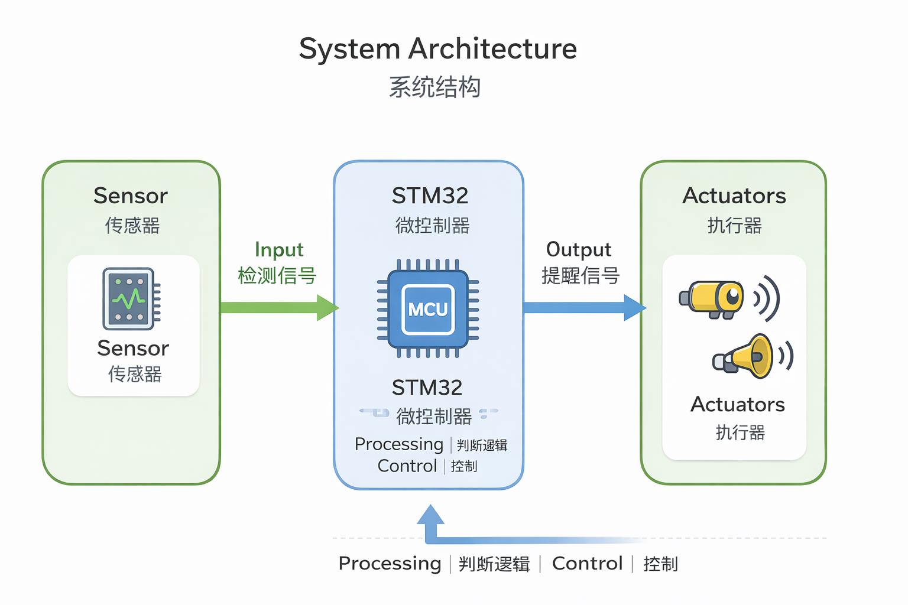

# 🎣 Smart Fishing Alert

STM32-based fishing bite detection and alert system


---

## 📌 项目简介

本项目旨在设计一个基于 STM32 的智能钓鱼咬钩提醒装置。

当鱼竿检测到疑似咬钩信号时，系统能够通过震动或蜂鸣器进行提醒，从而提升钓鱼体验与效率。

---

## 🧩 系统结构图

> 系统由传感器模块、STM32控制模块和提醒模块组成，实现信号检测与提醒功能



---

## 🚧 当前进度

目前项目处于 **前期框架搭建阶段**：

- 已完成仓库初始化
- 正在规划系统结构
- STM32 工程代码尚未开发

---

## ⚙️ 计划功能

- 🎯 咬钩信号检测（传感器输入）
- 🧠 STM32 信号处理
- 🔔 蜂鸣器提醒
- 📳 震动提醒
- 🔋 低功耗设计（可扩展）

---
## 🔮 后续计划

- 学习 STM32 基础（GPIO / 输入输出）
- 搭建最小系统
- 完成传感器接入
- 实现咬钩检测逻辑
- 完成提醒模块开发
- 项目整体调试与优化

---
## 👤 作者

-Haoran Fei  
-Electronic Information Science Student  
-Currently struggling with STM32 & embedded systems 😅 
## 📂 项目结构

```text
smart-fishing-alert/
├── README.md
├── code/        # STM32代码
├── docs/        # 方案文档
├── hardware/    # 硬件设计
└── images/      # 图片资源

---
