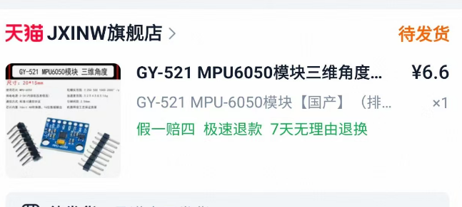
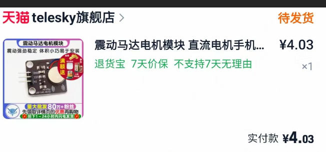

# 📄 项目文档（Docs）

本目录用于存放项目的整体设计方案、系统分析以及硬件与软件实现思路。

---

## 🧩 系统结构说明

本系统主要由三个核心模块组成：

---

### 1️⃣ 感知模块（MPU6050）

- 使用 MPU6050 采集鱼竿的振动与姿态变化数据  
- 将运动状态转换为可供 STM32 处理的信号  

#### 📷 模块示意图



---

### 2️⃣ 控制模块（STM32F407ZG）

- 采集并处理 MPU6050 传感器数据  
- 判断是否发生疑似咬钩行为  
- 控制提醒模块输出信号  

---

### 3️⃣ 提醒模块（执行器）

- 震动马达：用于无声提醒  
- 蜂鸣器：用于声音提示  

#### 📷 马达模块示意图



---

## ⚙️ 工作流程

```text
MPU6050（采集振动数据）
        ↓
STM32（数据处理与判断）
        ↓
震动马达 / 蜂鸣器（提醒输出）